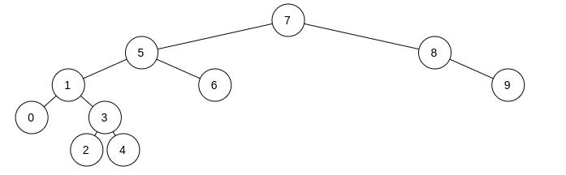

# Binary Search Tree

1. [7, 5, 1, 8, 3, 6, 0, 9, 4, 2]

2. [7] Root

3. [5] değeri [7] değerinin sol tarafında

4. [1] değeri [7] değerinin sol tarafında, [5] değerinin sol tarafında

5. [8] değeri [7] değerinin sağ tarafında

6. [3] değeri [7] değerinin sol tarafında, [5] değerinin sol tarafında, [1] değerinin sağ tarafında

7. [6] değeri [7] değerinin sol tarafında, [5] değerinin sağ tarafında

8. [0] değeri [7] değerinin sol tarafında, [5] değerinin sol tarafında, [1] değerinin sol tarafında

9. [9] değeri [7] değerinin sağ tarafında, [8] değerinin sağ tarafında

10. [4] değeri [7] değerinin sol tarafında, [5] değerinin sol tarafında, [1] değerinin sağ tarafında, [3] değerinin sağ tarafında

11. [2] değeri [7] değerinin sol tarafında, [5] değerinin sol tarafında, [1] değerinin sağ tarafında, [3] değerinin sol tarafında

